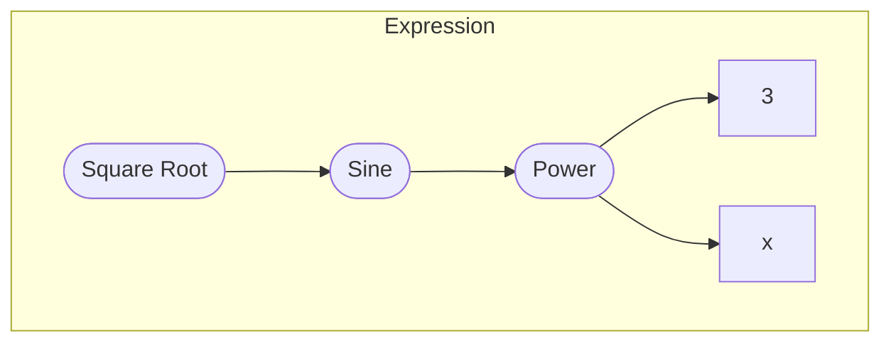
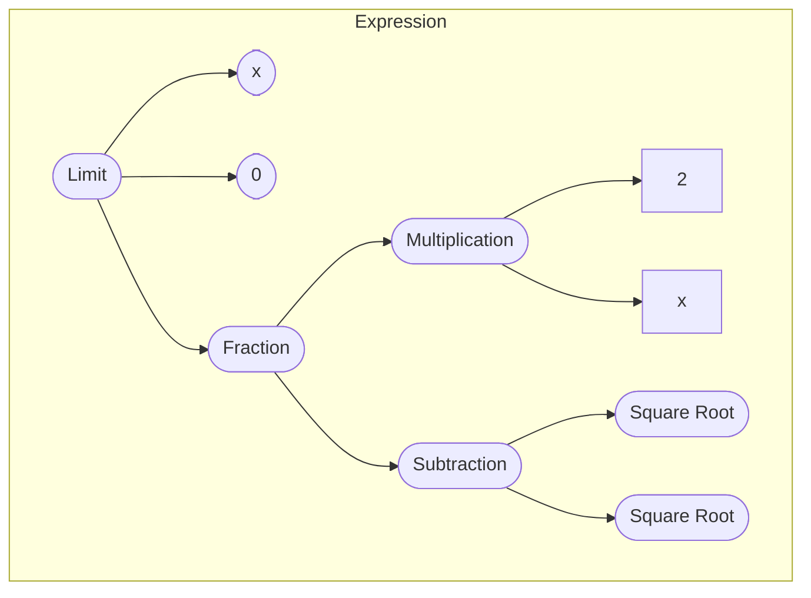

# Cantor

1. $\sqrt{\sin{(x^{3})}}$

```mermaid
graph TD
    subgraph Expression
        sqrt([Square Root])
        sin([Sine])
        exp([Power])
        sqrt-->sin
        sin-->exp
        exp-->x
        exp-->3
    end
```
2. $\lim\limits_{x \to 0} \frac{2x}{\sqrt{2x^2+x+1}-\sqrt{x^2-3x+1}}$

```mermaid
graph TD
    subgraph Expression
        lim([Limit])
        as([x])
        approaches([0])
        func([Fraction])
        lim-->as
        lim-->approaches
        lim-->func

        top([Multiplication])
        bottom([Subtraction])

        func-->top
        func-->bottom

        top-->2
        top-->x

        left([Square Root])
        right([Square Root])

        bottom-->left
        bottom-->right

        
    end
```
